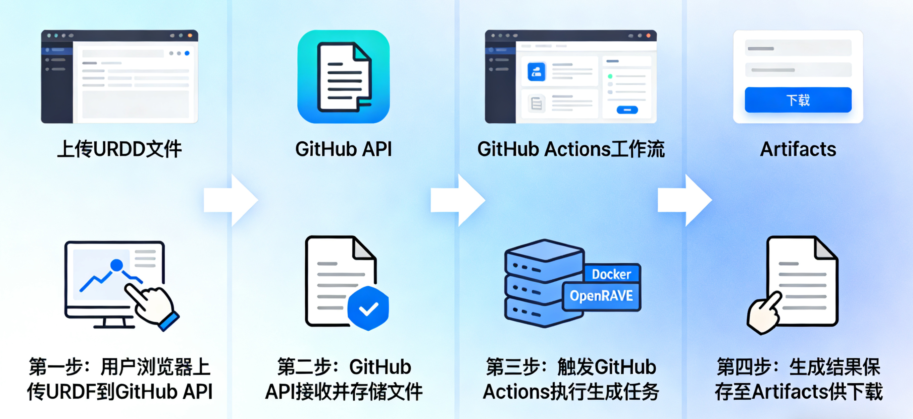

# 打造零成本的 IKFast 在线生成平台

> 一个完全基于 GitHub 免费服务的机器人逆运动学求解器生成平台

## 项目背景

在机器人开发中，逆运动学（Inverse Kinematics, IK）求解是一个核心问题。给定机器人末端执行器的目标位置和姿态，如何计算各个关节的角度？传统的数值解法虽然通用，但速度较慢。而 IKFast 能够为特定机器人生成高度优化的解析解代码，速度提升数百倍。

然而，使用 IKFast 的门槛不低：
- 需要安装 OpenRAVE 及其复杂的依赖环境
- 配置过程繁琐，版本兼容性问题频发
- 对新手不友好，学习曲线陡峭

能否让开发者通过浏览器就能生成 IKFast 求解器，无需任何本地配置？这就是 **IKFast Online Generator** 诞生的初衷。

## 核心创意：零服务器成本架构

这个项目最大的亮点是**完全不需要自己的服务器**，所有功能都基于 GitHub 的免费服务实现：



### 技术栈选择

**前端**：纯原生 JavaScript（ES6+）
- 无需构建工具，直接部署到 GitHub Pages
- 使用 ES6 模块化组织代码
- 采用 Graphite 模板实现现代化 UI

**后端**：GitHub Actions + Docker
- 利用 GitHub Actions 的免费计算资源
- 使用 `fishros2/openrave` Docker 镜像提供 OpenRAVE 环境
- 通过 workflow_dispatch 实现按需触发

**存储**：GitHub Repository + Artifacts
- URDF 文件存储在仓库的 `jobs/current/` 目录
- 生成结果通过 Artifacts 机制分发
- 7 天自动清理，节省存储空间

## 部署与使用

### 快速部署

1. **Fork 仓库**
```bash
git clone https://github.com/shine-tong/ikfast-online.git
cd ikfast-online
```

2. **配置仓库信息**
编辑 `docs/js/config.js`：
```javascript
const CONFIG = {
  REPO_OWNER: 'your-username',
  REPO_NAME: 'ikfast-online',
  REPO_BRANCH: 'master'
};
```

3. **启用 GitHub Pages**
- 进入仓库 Settings → Pages
- Source 选择 `master` 分支的 `/docs` 文件夹
- 保存后等待部署完成

4. **获取 Personal Access Token**
- 访问 GitHub Settings → Developer settings → Personal access tokens
- 生成新 Token，勾选 `repo` 和 `workflow` 权限

### 使用流程

1. **认证**：输入 GitHub Token 并验证
2. **上传**：选择 URDF 文件并上传
3. **查看链接**：自动提取并显示机器人链接结构
4. **配置参数**：设置 Base Link、End Effector 和求解器类型
5. **生成**：提交任务并实时查看执行日志
6. **下载**：获取生成的 C++ 求解器代码

## 性能与限制

### 资源配额

- **GitHub Actions**：每月 2000 分钟免费额度（公开仓库无限制）
- **Artifact 存储**：500MB 免费空间，7 天自动清理
- **API 调用**：每小时 5000 次（已认证）

### 执行性能

- **链接信息提取**：1-2 分钟
- **求解器生成**：5-15 分钟（取决于机器人复杂度）
- **超时限制**：30 分钟

### 适用场景

✅ 适合：
- 标准串联机械臂（6-7 自由度）
- 学习和原型开发
- 偶尔使用的场景

❌ 不适合：
- 并联机构
- 超过 7 自由度的复杂机器人
- 需要高频生成的生产环境

## 开源与贡献

这个项目完全开源，欢迎任何形式的贡献：

- 🐛 报告 Bug
- 💡 提出新功能建议
- 📝 改进文档
- 🔧 提交代码修复
- ⭐ 给项目点个 Star

**项目地址**：[https://github.com/shine-tong/ikfast-online](https://github.com/shine-tong/ikfast-online)

**在线体验**：[https://shine-tong.github.io/ikfast-online/](https://shine-tong.github.io/ikfast-online/)

## 总结

IKFast Online Generator 证明了一个理念：**利用现有的免费服务，可以构建出功能完整、体验良好的 Web 应用，而无需任何服务器成本**。

这个项目的核心价值不仅在于降低了 IKFast 的使用门槛，更在于展示了一种创新的架构思路：
- GitHub Pages 作为前端托管
- GitHub Actions 作为计算引擎
- GitHub API 作为数据通道
- Docker 提供隔离的执行环境

希望这个项目能够帮助更多机器人开发者，也希望这种架构思路能够启发更多有趣的应用。

---

**技术栈**：JavaScript (ES6+) · GitHub Actions · Docker · OpenRAVE · IKFast

**关键词**：机器人 · 逆运动学 · 无服务器 · GitHub Pages · 开源

**项目状态**：✅ 生产可用 · 持续维护

---

*本文介绍的项目完全使用 [Kiro](https://kiro.dev/) AI 编程助手生成，从前端到后端，从测试到文档，展示了 AI 辅助开发的强大能力。*
