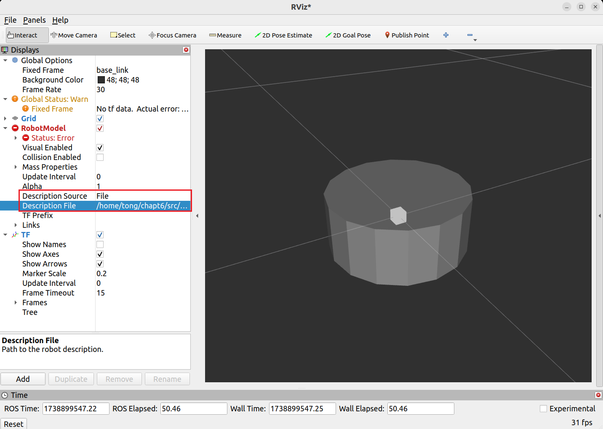

# ROS2 常用工具

### 1. TF

- 使用`tf`命令发布坐标关系

  ```bash
  ros2 run tf2_ros static_transform_publisher --x 0.1 --y 0.0 --z 0.2 --roll 0.0 --pitch 0.0 --yaw 0.0 --frame-id base_link
  	 --child-frame-id base_laser
  ```

  > `static_transform_publisher`：静态坐标变换（固定不变的坐标系才使用静态坐标变换，否则应使用动态坐标变换）
  >
  > `x, y, z`：空间坐标值
  >
  > `R, P, Y`：空间旋转值
  >
  > `--frame-id`：父link
  >
  > `--child-frame-id`：子link
  >
- 使用`tf`命令计算`link`间的转换关系

  ```bash
  ros2 run tf2_ros tf2_echo <link1> <link2>
  ```
- 使用`view_frames`查看坐标系的连接关系

  ```bash
  ros2 run tf2_tools view_frames

  ---
  [INFO] [1737509566.070758685] [view_frames]: Listening to tf data for 5.0 seconds...
  [INFO] [1737509571.112308082] [view_frames]: Generating graph in frames.pdf file...
  [INFO] [1737509571.116881959] [view_frames]: Result:tf2_msgs.srv.FrameGraph_Response(frame_yaml="base_laser: \n  parent: 'base_link'\n  broadcaster: 'default_authority'\n  rate: 10000.000\n  most_recent_transform: 0.000000\n  oldest_transform: 0.000000\n  buffer_length: 0.000\nwall_link: \n  parent: 'base_laser'\n  broadcaster: 'default_authority'\n  rate: 10000.000\n  most_recent_transform: 0.000000\n  oldest_transform: 0.000000\n  buffer_length: 0.000\n")
  ```

  > 该命令会生成一个`.gv`文件和一个`pdf`文件
  >
- 使用`Python`发布静态TF

  ```python
  import math
  import rclpy
  from rclpy.node import Node
  from geometry_msgs.msg import TransformStamped
  from tf2_ros import StaticTransformBroadcaster
  from tf_transformations import quaternion_from_euler

  class StaticTFPublisher(Node):
      def __init__(self, node_name):
          super().__init__(node_name)
          self.static_broadcaster = StaticTransformBroadcaster(self)  # 该类需要传入一个node作为参数
          self.pub_static_tf()

      def pub_static_tf(self):
          # 实例化TransformStamped类
          transform = TransformStamped()
          transform.header.stamp = self.get_clock().now().to_msg()
          transform.header.frame_id = "base_link"     # 父link
          transform.child_frame_id = "camera_link"    # 子link

          # xyz平移变换
          transform.transform.translation.x = 0.5
          transform.transform.translation.y = 0.3
          transform.transform.translation.z = 0.6

          # xyzw四元数旋转变换
          q = quaternion_from_euler(math.radians(180), 0, 0)
          transform.transform.rotation.x = q[0]
          transform.transform.rotation.y = q[1]
          transform.transform.rotation.z = q[2]
          transform.transform.rotation.w = q[3]

          self.static_broadcaster.sendTransform(transform)
          self.get_logger().info(f'发布TF: {transform}')

  def main():
      rclpy.init()
      node = StaticTFPublisher('static_tf_pub')
      rclpy.spin(node)
      rclpy.shutdown()
  ```

  > `StaticTransformBroadcaster(self)`：`self`参数表示将自身节点对象作为参数
  >
  > **静态坐标变换只会发布一次，ROS2会保留其数据，订阅者可直接订阅到所需的静态坐标变换数据**
  >
- 使用`Python`发布动态TF

  ```python
  import math
  import rclpy
  from rclpy.node import Node
  from geometry_msgs.msg import TransformStamped
  from tf2_ros import TransformBroadcaster
  from tf_transformations import quaternion_from_euler

  class DynamicTFPublisher(Node):
      def __init__(self, node_name):
          super().__init__(node_name)
          self.dynamic_tf_broadcaster = TransformBroadcaster(self)
          # 创建定时器定时发送tf数据
          self.timer = self.create_timer(0.01, self.tf_pub_callback)

      def tf_pub_callback(self):
          transform = TransformStamped()
          transform.header.stamp = self.get_clock().now().to_msg()
          transform.header.frame_id = "camera_link"
          transform.child_frame_id = "bottle_link"

          transform.transform.translation.x = 0.2
          transform.transform.translation.y = 0.3
          transform.transform.translation.z = 0.5

          q = quaternion_from_euler(0, 0, 0)
          transform.transform.rotation.x = q[0]
          transform.transform.rotation.y = q[1]
          transform.transform.rotation.z = q[2]
          transform.transform.rotation.w = q[3]

          self.dynamic_tf_broadcaster.sendTransform(transform)
          self.get_logger().info(f'发布TF: {transform}')


  def main():
      rclpy.init()
      node = DynamicTFPublisher('tf_pub')
      rclpy.spin(node)
      rclpy.shutdown()
  ```

  > **动态坐标变换需要持续的发布才有效**
  >
- 使用`Python`查看TF关系

  ```python
  import rclpy
  from rclpy.node import Node
  from tf2_ros import TransformListener, Buffer
  from tf_transformations import euler_from_quaternion

  class TFLisener(Node):
      def __init__(self, node_name):
          super().__init__(node_name)
          # 缓冲类，用来存放TF数据
          self.buffer = Buffer() 
          self.tf_lisener = TransformListener(self.buffer, self)
          self.timer = self.create_timer(1.0, self.get_transform_callback)

      def get_transform_callback(self):
          try:
              result = self.buffer.lookup_transform(
                  'base_link',
                  'bottle_link',
                  rclpy.time.Time(seconds=0.0),
                  rclpy.time.Duration(seconds=1.0)
              )
              transform = result.transform
              rotation_euler = euler_from_quaternion([
                  transform.rotation.x,
                  transform.rotation.y,
                  transform.rotation.z,
                  transform.rotation.w,
              ])
              self.get_logger().info(f'平移: {transform.translation}, 旋转四元数: {transform.rotation}, 旋转欧拉角: {rotation_euler}')

          except Exception as e:
              self.get_logger().warn(f'获取坐标变换失败，原因: {str(e)}')


  def main():
      rclpy.init()
      node = TFLisener('tf_lisener')
      rclpy.spin(node)
      rclpy.shutdown()
  ```

### 2. URDF模型

- `URDF`文件标签

  ```xml
  <?xml version="1.0"?>
  <robot name="first_robot">
      <!-- 机器人身体部分 -->
      <link name="base_link">
          <!-- 部件显示描述 -->
          <visual>
              <!-- 偏移和旋转是基于自身几何中心 -->
              <origin xyz="0.0 0.0 0.0" rpy="0.0 0.0 0.0"/>
              <!-- 定义部件形状 -->
              <geometry>
                  <cylinder radius="0.12" length="0.1"/>
              </geometry>
              <!-- 定义部件的颜色和材质 -->
              <material name="white">
                  <color rgba="1.0 1.0 1.0 0.5"/>
              </material>
          </visual>
      </link>

      <!-- 机器人IMU部件 -->
      <link name="imu_link">
          <!-- 部件显示描述 -->
          <visual>
              <!-- 偏移和旋转是基于自身几何中心 -->
              <origin xyz="0.0 0.0 0.0" rpy="0.0 0.0 0.0"/>
              <!-- 定义部件形状 -->
              <geometry>
                  <box size="0.02 0.02 0.02"/>
              </geometry>
              <!-- 定义部件的颜色和材质 -->
              <material name="white">
                  <color rgba="0.0 0.0 0.0 0.5"/>
              </material>
          </visual>
      </link>

      <!-- 定义连接机器人身体和IMU的关节 -->
      <joint name="imu_joint" type="fixed">
          <parent link="base_link"/>
          <child link="imu_link"/>
          <origin xyz="0.0 0.0 0.05" rpy="0.0 0.0 0.0"/>
      </joint>

  </robot>
  ```
- 可以使用`urdf_to_graghviz`命令查看转换关系

  ```bash
  urdf_to_graghviz robot_urdf.urdf robot_urdf

  -------------------------
  Created file robot_urdf.gv
  Created file robot_urdf.pdf
  ```

### 3. 使用Rviz显示URDF模型

- 直接使用`rviz`查看`urdf`模型

  ```bash
  rviz2
  ```

  

  > - `Description Source`：选择`File`
  > - `Description File`：选择`urdf`文件所在路径
  > - `Fixed Frame`：选择`base_link`
  >


- 编写`launch`文件来查看`urdf`模型

  - 安装依赖

    ```bash
    sudo apt install ros-$ROS_DISTRO-robot-state-publisher
    sudo apt install ros-$ROS_DISTRO-joint-state-publisher
    ```
  - 编写`launch`文件

    ```python
    import launch
    import launch_ros
    from ament_index_python.packages import get_package_share_directory
    import launch_ros.parameter_descriptions

    def generate_launch_description():
        # 获取默认路径
        urdf_tutorial_path = get_package_share_directory('robot_description')
        default_model_path = urdf_tutorial_path + '/urdf/robot_urdf.urdf'
        default_rviz_config_path = urdf_tutorial_path + '/config/rviz/display_model.rviz'

        # 为launch声明参数
        action_declare_arg_model_path = launch.actions.DeclareLaunchArgument(
            name='model',
            default_value=default_model_path,
            description='URDF的绝对路径'
        )

        # 获取文件内容生成新的参数
        robot_description = launch_ros.parameter_descriptions.ParameterValue(
            launch.substitutions.Command(
                ['cat ', launch.substitutions.LaunchConfiguration('model')]
            ),
            value_type=str
        )

        # 状态发布节点
        robot_state_publisher_node = launch_ros.actions.Node(
            package='robot_state_publisher',
            executable='robot_state_publisher',
            parameters=[{'robot_description': robot_description}]
        )

        # 关节状态发布节点
        joint_state_publisher_node = launch_ros.actions.Node(
            package='joint_state_publisher',
            executable='joint_state_publisher',
        )

        # Rviz节点
        rviz_node = launch_ros.actions.Node(
            package='rviz2',
            executable='rviz2',
            arguments=['d', default_rviz_config_path]
        )

        return launch.LaunchDescription([
            action_declare_arg_model_path,
            joint_state_publisher_node,
            robot_state_publisher_node,
            rviz_node
        ])
    ```
  - 在`CMakeLists.txt`中将`urdf`和`launch`文件复制到`install`目录下

    ```python
    install(DIRECTORY launch urdf
    	DESTINATION share/${PROJECT_NAME}
    )
    ```
  - 可将`Rviz`配置保存到功能包的`config/rviz`目录下，方便`launch`文件读取

    ```python
    	...
    def generate_launch_description():
    	...
    	default_rviz_config_path = urdf_tutorial_path + '/config/rviz/display_model.rviz'
    	...
    	# Rviz节点
    	rviz_node = launch_ros.actions.Node(
    		package='rviz2',
    		executable='rviz2',
    		arguments=['-d', default_rviz_config_path]
    	)
    	...
    ```

    > 修改`CMakeLists`，将`config`目录下的内容复制到`install`目录下，防止运行时找不到配置文件
    >

### 4. xacro

- 使用`xacro`简化`urdf`模型

  - 安装`xacro`

    ```xml
    sudo apt install ros-$ROS_DISTRO-xacro
    ```
  - `xacro`宏定义的结构

    ```xml
    <?xml version="1.0"?>
    <robot xmlns:xacro="http://www.ros.org/wiki/xacro" name="first_robot">
        <!-- 声明base_link模块 -->
        <xacro:macro name='base_link' params="radius length">
            <link name="base_link">
                <visual>
                    <origin xyz="0.0 0.0 0.0" rpy="0.0 0.0 0.0"/>
                    <geometry>
                        <cylinder radius="${radius}" length="${length}"/>
                    </geometry>
                    <material name="white">
                        <color rgba="1.0 1.0 1.0 0.5"/>
                    </material>
                </visual>
            </link>
        </xacro:macro>

        <!-- 声明imu模块 -->
        <xacro:macro name='imu_link' params="imu_name xyz">
            <link name="${imu_name}_link">
                <visual>
                    <origin xyz="0.0 0.0 0.0" rpy="0.0 0.0 0.0"/>
                    <geometry>
                        <box size="0.02 0.02 0.02"/>
                    </geometry>
                    <material name="black">
                        <color rgba="0.0 0.0 0.0 0.5"/>
                    </material>
                </visual>
            </link>
            <joint name="${imu_name}_joint" type="fixed">
                <parent link="base_link"/>
                <child link="${imu_name}_link"/>
                <origin xyz="${xyz}"/>
            </joint>
        </xacro:macro>

        <!-- 传递参数调用base_link模块 -->
        <xacro:base_link radius='0.1' length='0.12'/>
        <!-- 传递参数调用imu模块 -->
        <xacro:imu_link imu_name='imu_up' xyz='0 0 0.02'/>
        <xacro:imu_link imu_name='imu_down' xyz='0 0 -0.02'/>
    </robot>
    ```
  - 使用命令将`xacro`转换为`urdf`

    ```xml
    xacro first_robot.urdf.xacro

    --------
    <?xml version="1.0" ?>
    <!-- =================================================================================== -->
    <!-- |    This document was autogenerated by xacro from robot_urdf.xacro               | -->
    <!-- |    EDITING THIS FILE BY HAND IS NOT RECOMMENDED                                 | -->
    <!-- =================================================================================== -->
    <robot name="first_robot">
      <link name="base_link">
        <visual>
          <origin rpy="0.0 0.0 0.0" xyz="0.0 0.0 0.0"/>
          <geometry>
            <cylinder length="0.12" radius="0.1"/>
          </geometry>
          <material name="white">
            <color rgba="1.0 1.0 1.0 0.5"/>
          </material>
        </visual>
      </link>
      <link name="imu_up_link">
        <visual>
          <origin rpy="0.0 0.0 0.0" xyz="0.0 0.0 0.0"/>
          <geometry>
            <box size="0.02 0.02 0.02"/>
          </geometry>
          <material name="black">
            <color rgba="0.0 0.0 0.0 0.5"/>
          </material>
        </visual>
      </link>
      <joint name="imu_up_joint" type="fixed">
        <parent link="base_link"/>
        <child link="imu_up_link"/>
        <origin xyz="0 0 0.02"/>
      </joint>
      <link name="imu_down_link">
        <visual>
          <origin rpy="0.0 0.0 0.0" xyz="0.0 0.0 0.0"/>
          <geometry>
            <box size="0.02 0.02 0.02"/>
          </geometry>
          <material name="black">
            <color rgba="0.0 0.0 0.0 0.5"/>
          </material>
        </visual>
      </link>
      <joint name="imu_down_joint" type="fixed">
        <parent link="base_link"/>
        <child link="imu_down_link"/>
        <origin xyz="0 0 -0.02"/>
      </joint>
    </robot>
    ```
- 使用`launch`命令在`rviz`中显示模型

  ```python
  def generate_launch_description():
  	...
  	# 获取文件内容生成新的参数，将cat替换为xacro即可
  	robot_description = launch_ros.parameter_descriptions.ParameterValue(
  		launch.substitutions.Command(
  			['xacro ', launch.substitutions.LaunchConfiguration('model')]
  		),
  		value_type=str
  	)
  	...
  ```