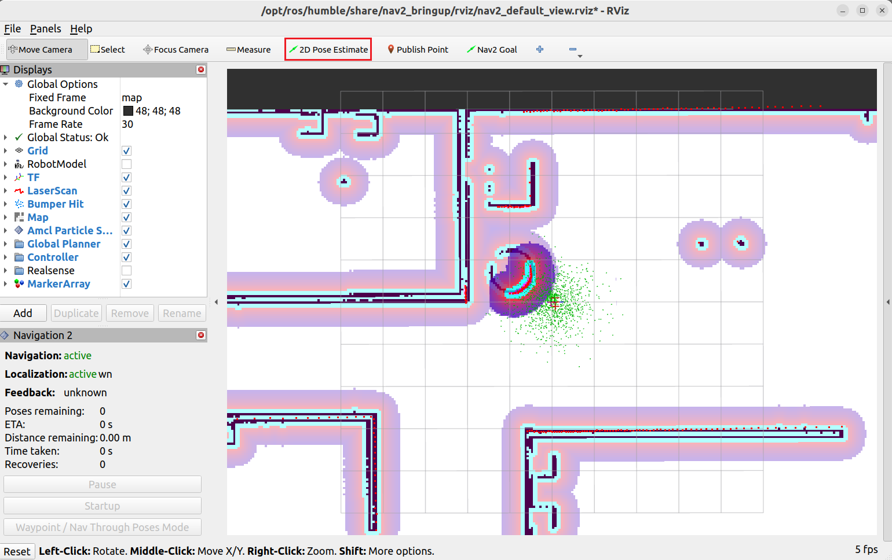
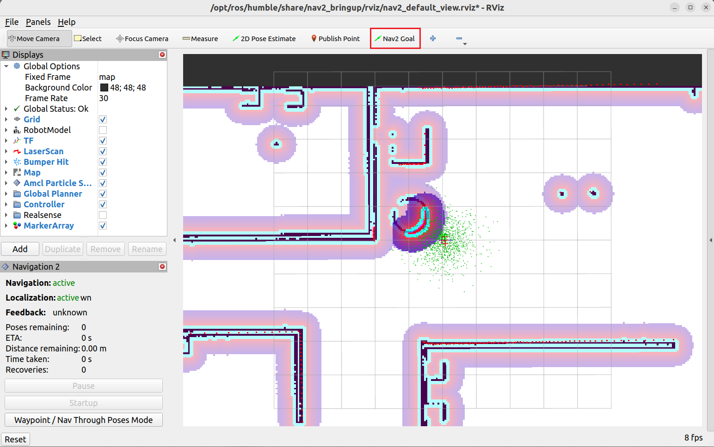
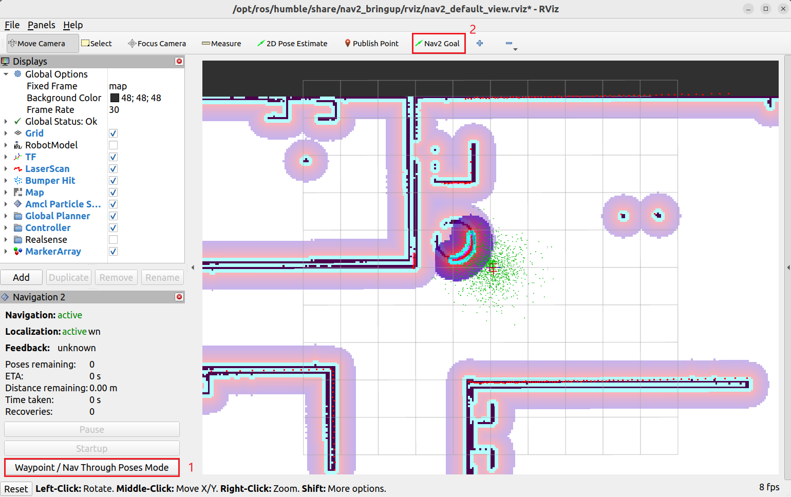

# ROS2 建图和导航

### 1. SLAM建图

- 安装`SLAM`建图相关工具

  ```bash
  sudo apt install ros-humble-slam-toolbox
  ```
- 以仿真时间启动`slam-toolbox`

  ```bash
  ros2 launch slam_toolbox online_async_launch.py use_sim_time:=True
  ```

    > `slam_toolbox`的输入有两个，第一个是订阅来自雷达的`/scan`话题，用来获取雷达数据；另一个是获取里程计坐标系`/odom`到机器人坐标系`/base_footprint`的坐标转换。这些数据都含有时间戳，因此使用Gazebo的仿真时间来防止因时间戳造成的数据不合法

- 使用`rviz`查看地图信息

  - 使用命令`rviz2`打开rviz
  - 修改`Fixed Frame`为`map`
  - 执行`Add → By topic`，添加`/map`和`/camera_sensor/image_raw/image`话题
- 启动键盘控制节点，控制机器人完成建图

  ```bash
  ros2 run teleop_twist_keyboard teleop_twist_keyboard 
  ```

  > 因雷达扫描速率不够，当在控制机器人进行建图的时候，速度和加速度应控制在一个合适的范围内（尽量速度慢一些），防止因速度过大造成较大的测量误差。
  >
- 保存地图，用于后续导航服务

  - 安装地图服务

    ```bash
    sudo apt install ros-humble-nav2-map-server
    ```
  - 保存地图

    ```bash
    ros2 run nav2_map_server map_server_cli -f <map_name>

    -----
    room.pgm
    room.yaml
    ```

    - `pgm`格式是一种图片格式，使用常用图片查看器可以查看，也可以使用`Photoshop`等软件修改
    - `room.yaml`的配置信息

      ```yaml
      image: room.pgm				
      mode: trinary		
      resolution: 0.05
      origin: [-10.4, -6.53, 0]
      negate: 0
      occupied_thresh: 0.65
      free_thresh: 0.25
      ```

      > `image`：地图名称
      >
      > `mode`：地图类型，参数`trinary`表示地图中的每个像素点有三种可能的状态：障碍物的占据(occupied)状态用==黑色==表示；无障碍的自由(free)状态用==白色==表示；未探索的未知(unknown)状态用==灰色==表示
      >
      > `resolution`：地图分辨率，`0.05`表示每个像素对应的物理尺寸为0.05m
      >
      > `origin`：地图坐标系的原点，单位为m，默认设置在启动建图的位置
      >
      > `negate`：是否对地图进行取反操作，0表示不取反
      >
      > `occupied_thresh`：设置障碍物的占据状态，设置为`0.65`表示大于或等于0.65就认为该像素对应的位置为占据状态
      >
      > `free_thresh`：设置障碍物的自由状态，设置`0.25`表示小于或等于0.25就认为该像素对应的位置为自由状态
      >

### 2. Navigation2 导航

- 安装`Navigation2`相关工具

  ```bash
  sudo apt install ros-humble-navigation2
  sudo apt install ros-humble-nav2-bringup
  ```
- 配置`Navigation2`参数

  ```bash
  cp /opt/ros/humble/share/nav2_bringup/params/nav2_params.yaml src/fishrobot_navigition2/config
  ```

  > `nav2_bringup`提供了一个默认参数文件，我们只需在此基础上进行修改即可
  >
- 修改相关参数

  ```yaml
  local_costmap:
  	local_costmap:
  		ros_parameters:
  			...
  			robot_radius: 0.12

  global_costmap:
  	global_costmap:
  		ros_parameters:
  			...
  			robot_radius: 0.12
  ```

  > - 参数中带有`topic`的基本为关于话题的配置，例如`scan_topic`表示雷达数据话题名称，`odom_topic`表示里程计话题名称。
  > - 参数中带有`frame`的基本为关于坐标系的配置，例如`odom_frame_id`表示里程计坐标系的名称，`robot_base_frame`表示机器人基础坐标系名称
  > - 在配置机器人信息时，最好将相关话题名称和坐标系名称与`navigation2`配置名称保持一致
  > - 此外，还需要考虑机器人的半径`robot_radius`，需要在全局代价地图`global_costmap`和局部代价地图`local_costmap`的参数中进行配置，使其与真实机器人半径保持一致
  >
- 编写Launch文件并启动导航

  - 编写`launch`启动文件

    ```python
    import os
    import launch
    import launch_ros
    from ament_index_python.packages import get_package_share_directory
    from launch.launch_description_sources import PythonLaunchDescriptionSource

    def generate_launch_description():
        # 获取并拼接默认路径
        fishrobot_navigatiob2_dir = get_package_share_directory('fishrobot_navigation2')
        nav2_bringup_dir = get_package_share_directory('nav2_bringup')
        rviz_config_dir = os.path.join(
            nav2_bringup_dir, 'rviz', 'nav2_default_view.rviz'
        )

        # 创建launch配置
        use_sim_time = launch.substitutions.LaunchConfiguration(
            'use_sim_time', default=True
        )
        map_yaml_path = launch.substitutions.LaunchConfiguration(
            'map', default=os.path.join(fishrobot_navigatiob2_dir, 'maps', 'room.yaml')
        )
        nav2_param_path = launch.substitutions.LaunchConfiguration(
            'param_file', default=os.path.join(fishrobot_navigatiob2_dir, 'config', 'nav2_params.yaml')
        )

        return launch.LaunchDescription([
            # 声明新的Launch参数
            launch.actions.DeclareLaunchArgument(
                'use_sim_time', default_value=use_sim_time,
                description='Use simulation (Gazebo) clock if true'
            ),
            launch.actions.DeclareLaunchArgument(
                'map', default_value=map_yaml_path,
                description='Full path to map file to load'
            ),
            launch.actions.DeclareLaunchArgument(
                'params_file', default_value=nav2_param_path,
                description='Full path to param file to load'
            ),
            launch.actions.IncludeLaunchDescription(
                PythonLaunchDescriptionSource(
                    [nav2_bringup_dir, '/launch', '/bringup_launch.py']
                ),
                # 使用launch参数替换原有参数
                launch_arguments={
                    'map': map_yaml_path,
                    'use_sim_time': use_sim_time,
                    'params_file': nav2_param_path
                }.items(),
            ),
            launch_ros.actions.Node(
                package='rviz2',
                executable='rviz2',
                name='rviz2',
                arguments=['-d', rviz_config_dir],
                parameters=[{'use_sim_time': use_sim_time}],
                output='screen',
            )
        ])
    ```
  - 修改`CMakeList.txt`

    ```cmake
    ...
    install(DIRECTORY launch maps config
      DESTINATION share/${PROJECT_NAME}
    )
    ...
    ```
  - 启动仿真和导航

    ```bash
    # 启动仿真
    ros2 launch fishbot_description gazebo_sim.launch.py 

    # 启动导航
    ros2 launch fishbot_description navigation2.launch.py
    ```
- 单点导航和路店导航

  - 初始化机器人位置

    
  - 单点导航

    
  - 路点导航

    

    > 设定完路点后，单击`Start Waypoint Following`启动路点导航
    >
- 优化导航速度和膨胀半径

  - 修改`nav2_params.yaml`中的最大角速度和角加速度

    ```yaml
    controller_server:
    	ros_parameters:
    		...
    		FollowPath:
    			...
    			max_vel_theta: 0.8
    			acc_lim_theta: 2.0
    ```
  - 修改`nav2_params.yaml`中的膨胀半径

    ```yaml
    local_costmap:
    	local_costmap:
    		ros_parameters:
    			...
    			inflation_layer:
    				...
    				inflation_radius: 0.24

    global_costmap:
    	global_costmap:
    		ros_parameters:
    			...
    			inflation_layer:
    				...
    				inflation_radius: 0.24
    ```

    > 膨胀半径是代价地图中的一个参数，一般为机器人的直径大小
    >
- 优化机器人到点精度

  ```yaml
  controller_server:
  	ros_parameters:
  		...
  		general_goal_checker:
  			...
  			xy_goal_tolerance: 0.15
  			yaw_goal_tolerance: 0.15
  		# DWB parameters
  		FollowPath:
  			...
  			xy_goal_tolerance: 0.15
  			...
  ```

  > `xy_goal_tolerance`：位置允许误差
  >
  > `yaw_goal_tolerance`：角度允许误差
  >

### 3. 导航应用开发

- 使用话题初始化机器人位姿

  ```python
  import rclpy
  from geometry_msgs.msg import PoseStamped
  from nav2_simple_commander.robot_navigator import BasicNavigator

  def main():
      rclpy.init()
      nav = BasicNavigator()
      initial_pose = PoseStamped()
      initial_pose.header.frame_id = 'map'
      initial_pose.header.stamp = nav.get_clock().now().to_msg()
      initial_pose.pose.position.x = 0.0
      initial_pose.pose.position.y = 0.0
      initial_pose.pose.orientation.w = 1.0

      nav.setInitialPose(initial_pose)
      nav.waitUntilNav2Active()   # 等待导航变为可用状态
      rclpy.spin(nav)
      rclpy.shutdown()
  ```

  > 在使用`Navigation2`导航时，机器人在地图中的位置是由`amcl`节点根据地图以及传感器数据进行实时计算的。在开始导航之前，需要通过话题告知`amcl`机器人的大致位置，`amcl`才会进行计算。
  >
  > ```bash
  > ros2 node info /amcl
  >
  > --------
  > /amcl
  >   Subscribers:
  >     /bond: bond/msg/Status
  >     /clock: rosgraph_msgs/msg/Clock
  >     /initialpose: geometry_msgs/msg/PoseWithCovarianceStamped
  >     /map: nav_msgs/msg/OccupancyGrid
  >     /parameter_events: rcl_interfaces/msg/ParameterEvent
  >     /scan: sensor_msgs/msg/LaserScan
  >   Publishers:
  >     /amcl/transition_event: lifecycle_msgs/msg/TransitionEvent
  >     /amcl_pose: geometry_msgs/msg/PoseWithCovarianceStamped
  >     /bond: bond/msg/Status
  >     /parameter_events: rcl_interfaces/msg/ParameterEvent
  >     /particle_cloud: nav2_msgs/msg/ParticleCloud
  >     /rosout: rcl_interfaces/msg/Log
  >     /tf: tf2_msgs/msg/TFMessage
  >   Service Servers:
  >     /amcl/change_state: lifecycle_msgs/srv/ChangeState
  >     /amcl/describe_parameters: rcl_interfaces/srv/DescribeParameters
  >     /amcl/get_available_states: lifecycle_msgs/srv/GetAvailableStates
  >     /amcl/get_available_transitions: lifecycle_msgs/srv/GetAvailableTransitions
  >     /amcl/get_parameter_types: rcl_interfaces/srv/GetParameterTypes
  >     /amcl/get_parameters: rcl_interfaces/srv/GetParameters
  >     /amcl/get_state: lifecycle_msgs/srv/GetState
  >     /amcl/get_transition_graph: lifecycle_msgs/srv/GetAvailableTransitions
  >     /amcl/list_parameters: rcl_interfaces/srv/ListParameters
  >     /amcl/set_parameters: rcl_interfaces/srv/SetParameters
  >     /amcl/set_parameters_atomically: rcl_interfaces/srv/SetParametersAtomically
  >     /reinitialize_global_localization: std_srvs/srv/Empty
  >     /request_nomotion_update: std_srvs/srv/Empty
  >     /set_initial_pose: nav2_msgs/srv/SetInitialPose
  >   Service Clients:
  >
  >   Action Servers:
  >
  >   Action Clients:
  > ```
  >
- 使用`TF`监听机器人的位置信息

  ```python
  import rclpy
  from rclpy.node import Node
  import rclpy.time
  from tf2_ros import TransformListener, Buffer
  from tf_transformations import euler_from_quaternion

  class GetRobotPose(Node):
      def __init__(self):
          super().__init__('get_robot_pose')
          self.buffer = Buffer()
          self.listener = TransformListener(self.buffer, self)
          self.timer = self.create_timer(1, self.get_transform)

      def get_transform(self):
          try:
              tf = self.buffer.lookup_transform(
                  'map', 
                  'base_footprint', 
                  rclpy.time.Time(seconds=0),
                  rclpy.time.Duration(seconds=1)
              )
              transform = tf.transform
              roatation_euler = euler_from_quaternion([
                  transform.rotation.x,
                  transform.rotation.y,
                  transform.rotation.z,
                  transform.rotation.w
              ])
              self.get_logger().info(f'平移: {transform.translation},旋转四元数: {transform.rotation},旋转欧拉角: {roatation_euler}')
          except Exception as e:
              self.get_logger().info(f'获取坐标变换失败，原因: {str(e)}')

  def main():
      rclpy.init()
      node = GetRobotPose()
      rclpy.spin(node)
      rclpy.shutdown()
  ```
- 调用接口进行单点导航

  - 查看`nav2`动作列表

    ```python
    ros2 action list -t

    -----
    /assisted_teleop [nav2_msgs/action/AssistedTeleop]
    /backup [nav2_msgs/action/BackUp]
    /compute_path_through_poses [nav2_msgs/action/ComputePathThroughPoses]
    /compute_path_to_pose [nav2_msgs/action/ComputePathToPose]
    /drive_on_heading [nav2_msgs/action/DriveOnHeading]
    /follow_path [nav2_msgs/action/FollowPath]
    /follow_waypoints [nav2_msgs/action/FollowWaypoints]
    /navigate_through_poses [nav2_msgs/action/NavigateThroughPoses]
    /navigate_to_pose [nav2_msgs/action/NavigateToPose]
    /smooth_path [nav2_msgs/action/SmoothPath]
    /spin [nav2_msgs/action/Spin]
    /wait [nav2_msgs/action/Wait]
    ```

    > `/navigate_to_pose`：用于处理导航到点请求的动作
    >
  - 查看动作的详细信息

    ```python
    ros2 action info /navigate_to_pose -t

    ------
    Action: /navigate_to_pose
    Action clients: 4
        /bt_navigator [nav2_msgs/action/NavigateToPose]
        /waypoint_follower [nav2_msgs/action/NavigateToPose]
        /rviz2 [nav2_msgs/action/NavigateToPose]
        /rviz_navigation_dialog_action_client [nav2_msgs/action/NavigateToPose]
    Action servers: 1
        /bt_navigator [nav2_msgs/action/NavigateToPose]
    ```

    > 上述信息中包含动作的客户端、服务端以及消息接口的情况
    >
  - 查看消息接口定义

    ```python
    ros2 interface show nav2_msgs/action/NavigateToPose

    -------
    #goal definition
    geometry_msgs/PoseStamped pose
    	std_msgs/Header header
    		builtin_interfaces/Time stamp
    			int32 sec
    			uint32 nanosec
    		string frame_id
    	Pose pose
    		Point position
    			float64 x
    			float64 y
    			float64 z
    		Quaternion orientation
    			float64 x 0
    			float64 y 0
    			float64 z 0
    			float64 w 1
    string behavior_tree
    ---
    #result definition
    std_msgs/Empty result
    ---
    #feedback definition
    geometry_msgs/PoseStamped current_pose
    	std_msgs/Header header
    		builtin_interfaces/Time stamp
    			int32 sec
    			uint32 nanosec
    		string frame_id
    	Pose pose
    		Point position
    			float64 x
    			float64 y
    			float64 z
    		Quaternion orientation
    			float64 x 0
    			float64 y 0
    			float64 z 0
    			float64 w 1
    builtin_interfaces/Duration navigation_time
    	int32 sec
    	uint32 nanosec
    builtin_interfaces/Duration estimated_time_remaining
    	int32 sec
    	uint32 nanosec
    int16 number_of_recoveries
    float32 distance_remaining
    ```

    > 动作消息的接口分为`目标`、`结果`和`反馈`三个部分
    >
  - 使用代码请求导航到目标点

    ```python
    import rclpy
    from rclpy.duration import Duration
    from geometry_msgs.msg import PoseStamped
    from nav2_simple_commander.robot_navigator import BasicNavigator, TaskResult

    def main():
        rclpy.init()
        nav = BasicNavigator()
        # 等待导航变为可用状态
        nav.waitUntilNav2Active()   
        # 设置目标点坐标
        goal_pose = PoseStamped()
        goal_pose.header.frame_id = 'map'
        goal_pose.header.stamp = nav.get_clock().now().to_msg()
        goal_pose.pose.position.x = 1.0
        goal_pose.pose.position.y = 1.0
        goal_pose.pose.orientation.w = 1.0
        # 发送目标点并接收反馈结果
        nav.goToPose(goal_pose)
        while not nav.isTaskComplete():
            feedback = nav.getFeedback()
            nav.get_logger().info(f'预计: {Duration.from_msg(feedback.estimated_time_remaining).nanoseconds / 1e9}s 后到达')
            # 超时自动取消
            if Duration.from_msg(feedback.navigation_time) > Duration(seconds=600.0):
                nav.cancelTask()
        # 导航结果判断
        result = nav.getResult()
        if result == TaskResult.SUCCEEDED:
            nav.get_logger().info(f'导航结果: 成功')
        if result == TaskResult.CANCELED:
            nav.get_logger().warn(f'导航结果: 取消')    
        if result == TaskResult.FAILED:
            nav.get_logger().error(f'导航结果: 失败')
        else:
            nav.get_logger().error(f'导航结果: 反回状态无效')
    ```
- 调用接口完成路点导航

  - 查看路点跟随动作服务

    ```bash
    ros2 action info /follow_waypoints -t

    --------
    Action: /follow_waypoints
    Action clients: 2
    	/rviz2 [nav2_msgs/action/FollowWaypoints]
    	/rviz2 [nav2_msgs/action/FollowWaypoints]
    Action servers: 1
    	/waypoint_follower [nav2_msgs/action/FollowWaypoints]
    ```
  - 查看消息接口定义

    ```bash
    ros2 interface show nav2_msgs/action/FollowWaypoints

    ---------
    #goal definition
    geometry_msgs/PoseStamped[] poses
    	std_msgs/Header header
    		builtin_interfaces/Time stamp
    			int32 sec
    			uint32 nanosec
    		string frame_id
    	Pose pose
    		Point position
    			float64 x
    			float64 y
    			float64 z
    		Quaternion orientation
    			float64 x 0
    			float64 y 0
    			float64 z 0
    			float64 w 1
    ---
    #result definition
    int32[] missed_waypoints
    ---
    #feedback definition
    uint32 current_waypoint

    ```
  - 使用代码调用路点导航服务

    ```python
    import rclpy
    from rclpy.duration import Duration
    from geometry_msgs.msg import PoseStamped
    from nav2_simple_commander.robot_navigator import BasicNavigator, TaskResult

    def main():
        rclpy.init()
        nav = BasicNavigator()
        # 等待导航变为可用状态
        nav.waitUntilNav2Active()   
        # 设置目标路点
        waypoints = []

        goal_pose1 = PoseStamped()
        goal_pose1.header.frame_id = 'map'
        goal_pose1.header.stamp = nav.get_clock().now().to_msg()
        goal_pose1.pose.position.x = 0.0
        goal_pose1.pose.position.y = 0.0
        goal_pose1.pose.orientation.w = 1.0
        waypoints.append(goal_pose1)

        goal_pose2 = PoseStamped()
        goal_pose2.header.frame_id = 'map'
        goal_pose2.header.stamp = nav.get_clock().now().to_msg()
        goal_pose2.pose.position.x = 2.0
        goal_pose2.pose.position.y = 0.0
        goal_pose2.pose.orientation.w = 1.0
        waypoints.append(goal_pose2)

        goal_pose3 = PoseStamped()
        goal_pose3.header.frame_id = 'map'
        goal_pose3.header.stamp = nav.get_clock().now().to_msg()
        goal_pose3.pose.position.x = 2.0
        goal_pose3.pose.position.y = 2.0
        goal_pose3.pose.orientation.w = 1.0
        waypoints.append(goal_pose3)
        # 调用路点导航服务
        nav.followWaypoints(waypoints)
        # 判断结束及获取反馈
        while not nav.isTaskComplete():
            feedback = nav.getFeedback()
            nav.get_logger().info(f'当年目标路点标号: {feedback.current_waypoint}')
        # 导航结果判断
        result = nav.getResult()
        if result == TaskResult.SUCCEEDED:
            nav.get_logger().info(f'导航结果: 成功')
        if result == TaskResult.CANCELED:
            nav.get_logger().warn(f'导航结果: 取消')    
        if result == TaskResult.FAILED:
            nav.get_logger().error(f'导航结果: 失败')
        else:
            nav.get_logger().error(f'导航结果: 反回状态无效')
    ```