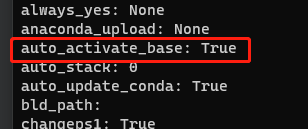

# Conda 常用命令

### 1. [参考教程](https://www.bilibili.com/video/BV1qSsheTEJj/?spm_id_from=333.880.my_history.page.click&vd_source=b90d1d18fba18ab1668f689f8289aca0)
### 2. 常用命令

```bash
1. 启动conda环境(base)
conda activate

2. 退出conda环境(base)
conda deactivate

3. 创建conda虚拟环境
conda create --name <ENV_NAME> python=version

4. 查看环境列表
conda env list

5. 进入创建的虚拟环境
conda activate <ENV_NAME>

6. 查看可安装软件包等列表
conda search

7. 查看当前环境已安装软件包列表
conda list

8. 安装软件包
conda install

9. 卸载软件包
conda uninstall <PACKAGE_NAME>=VERSION

10. 删除创建的虚拟环境（卸载之前应保证不在该环境内）
conda remove -n <ENV_NAME> --all
```

- 取消打开终端自动进入conda (base)虚拟环境

  - 查看conda配置信息：conda config --show

    
  - 修改`auto_activate_base`的值为`false：conda config --set auto_activate_base`
  - 重启终端