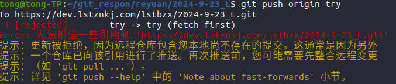

# Git 常用命令

### 1. 从目标仓库拉取代码

克隆到本地仓库中的文件夹中包含一个.git隐藏文件夹用来标注仓库
```bash
git clone https:<仓库地址>
```

### 2. 查看所有分支

```bash
git branch -a
```

### 3. 切换到基础分支，如`master`

```bash
git checkout master
```

### 4. 创建并切换到新分支

可以使用git branch命令查看自己当前所在的分支
```bash
git checkout -b <branch_name>
```

### 5. 更新分支代码并提交

```bash
git add .  //提交当前文件夹的内容
git commit -m "init name"
git push origin name
```

### 6. 切换到其他分支

```bash
git checkout <branch_name>
```

### 7. 直接复制指定分支到本地

注意：复制过来的文件夹名称仍为仓库名称
```bash
git clone -b <branch_name> <respon_url>
```

### 8. 删除本地分支

注意需要合并分支后才能使用该命令删除分支
```bash
git branch -d <branch_name>
```

### 9. 强制删除本地分支

```git
git branch -D <branch_name>
```

### 10. 删除远程分支，需要权限(账号密码)

```bash
git push origin --delete <branch_name>
```

### 11. 从指定分支中拉取指定文件夹到本地

```bash
git clone --no-checkout https://github.com/user/repo.git
cd repo
git checkout main
git sparse-checkout init --cone
git sparse-checkout set src
```

**如果提示以下错误**

**即本地分支与远程分支内容未保持一致**
**产生原因**：在远程分支中直接修改了文件内容，导致本地分支与远程分支文件内容不同步
**解决方法**:

```bash
1.使用git pull命令来同步远程分支
git pull origin try

2.使用git clone拉取最新仓库内容到本地分支，然后再进行推送
git clone -b try <respon_url>
git push origin try
```

### Git

```bash
1. 查看commit信息
git log

2. 回退到最后一次提交（hard参数慎用）
git reset HEAD --hard

3. 回退到特定版本
git reset <版本号>

4. 查看当前版本与其他版本之间的区别
git diff <版本号>

5. 创建新分支
git branch <branch_name>

6. 切换分支
git checkout <branch_name>

7. 从远程获取代码并合并本地的版本
git pull
```
